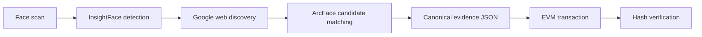

# FaceChain Verifier

**Face scan → live public-web discovery → biometric re-verification → blockchain proof.**

FaceChain is a consent-first OSINT verification pipeline built for the HH Goa 2026 shortlisting task. It accepts a face scan, discovers pages containing matching imagery through SerpAPI Google Lens, independently compares the faces with InsightFace/ArcFace, and anchors a canonical evidence fingerprint in an EVM transaction.

The system never treats reverse-image search alone as identity proof. Every discovered candidate is downloaded, re-encoded, scored, and thresholded before its evidence can reach the blockchain.

## Pipeline



| Stage | Implementation | Output |
|---|---|---|
| Face identification | InsightFace `buffalo_l` with normalized ArcFace embeddings | Bounding box, detector confidence, biometric vector |
| Web/social discovery | SerpAPI Google Lens image upload and visual matches | Real public page and matching-image URLs |
| Match verification | Cosine similarity over independently generated embeddings | Ranked candidates and thresholded best match |
| Evidence construction | Deterministic sorted JSON + SHA-256 | Reproducible `0x…` fingerprint |
| Blockchain anchoring | FaceChain v1 marker + 32-byte hash in EVM calldata | Transaction hash, block, chain ID, sender |
| Verification | Re-fetch transaction input and compare hashes | Pass/fail tamper result |

## Quick start

Python 3.11 or 3.12 is required.

```bash
git clone https://github.com/6289subhasree/facechain-verifier.git
cd facechain-verifier
git switch codex/initial-pipeline
python -m venv .venv
```

Activate it, then install the app and computer-vision runtime:

```bash
# Windows PowerShell
.venv\Scripts\Activate.ps1

# macOS / Linux
source .venv/bin/activate

python -m pip install -e ".[dev,face]"
cp .env.example .env  # Windows: copy .env.example .env
```

Set `SERPAPI_API_KEY` in `.env`, then run:

```bash
facechain-web
```

Open [http://localhost:8000](http://localhost:8000). Interactive API documentation is available at `/docs`.

> InsightFace downloads `buffalo_l` on the first scan and reuses the local model cache afterward.

## Live discovery setup

1. Create a free account at [SerpAPI](https://serpapi.com/).
2. Copy the private API key from the dashboard.
3. Add it to `.env` as `SERPAPI_API_KEY`.

FaceChain compresses the scan below SerpAPI's 500 KB upload limit, obtains a temporary `image_id`, and sends that ID to Google Lens. The scan does not need to be hosted at a public URL. `GOOGLE_VISION_API_KEY` remains available as an optional fallback.

## Blockchain modes

### Free local demo (default)

Leave `EVM_RPC_URL` and `EVM_PRIVATE_KEY` blank. FaceChain mines the proof on an in-process EthereumTester EVM. It costs nothing and demonstrates actual EVM calldata and tamper detection, but resets when the process stops.

### Persistent public testnet

Configure a testnet such as Sepolia:

```dotenv
EVM_RPC_URL=https://your-sepolia-rpc.example
EVM_PRIVATE_KEY=0xYOUR_DEDICATED_TESTNET_PRIVATE_KEY
EVM_CHAIN_NAME=Sepolia
EVM_EXPLORER_URL=https://sepolia.etherscan.io/tx
```

Use a dedicated testnet-only wallet with faucet ETH. Never commit `.env`. FaceChain signs locally, broadcasts, waits for the receipt, and returns an explorer link.

## Portable proof bundles

After a successful scan, select **Download proof JSON**. The bundle contains the canonical evidence and its chain receipt, but never the face image or biometric embedding.

To verify a saved bundle, use the **Check an existing proof** panel in the web app. FaceChain recomputes the evidence fingerprint, fetches the recorded transaction, and reports whether the JSON is unchanged. The same operation is available as `POST /api/proofs/verify` for other clients.

Local EthereumTester proofs can be checked only while that server process is running because its in-memory chain resets on restart. Proofs anchored to Sepolia or another persistent EVM remain independently verifiable after restarts.

## Reproducing a proof

Evidence includes the public page and image URLs, provider/rank, face model, score, decision, timestamp, and run metadata. It is serialized as deterministic UTF-8 JSON:

```python
fingerprint = "0x" + sha256(canonical_json_bytes).hexdigest()
calldata = b"FACECHAIN:v1:" + bytes.fromhex(fingerprint[2:])
```

Anyone with the proof bundle can reconstruct the fingerprint and compare it with the final 32 calldata bytes. Changing one evidence field produces a different hash and a tamper-detection result.

```bash
facechain proof-demo path/to/evidence.json
```

## Tests

```bash
pytest --cov=facechain --cov-report=term-missing
ruff check .
```

Coverage includes deterministic hashing, tamper detection, unsigned and signed EVM transactions, face similarity and selection, search normalization, private-network URL rejection, full orchestration, consent enforcement, and API privacy.

## Privacy and responsible use

- Explicit operator consent is required.
- Only public search results are considered.
- Raw biometric embeddings are excluded from API responses and evidence.
- The chain stores a one-way hash—not the face, embedding, or personal data.
- Downloads are size-bounded and private-network targets are rejected.
- Similarity supports verification; it is not a legal identity determination.

## Repository map

```text
src/facechain/
├── api.py          # FastAPI and web application
├── blockchain.py   # local/public EVM proofs
├── config.py       # environment settings
├── evidence.py     # canonical hashing
├── face.py         # InsightFace/ArcFace
├── pipeline.py     # orchestration
├── search.py       # SerpAPI/Google discovery and safe retrieval
└── web/            # responsive interface
```

MIT licensed.
