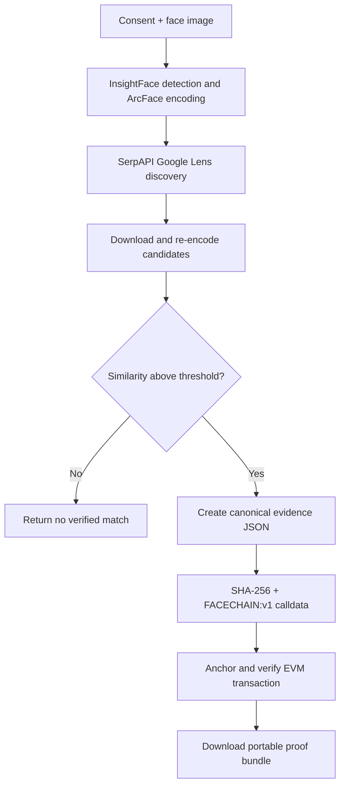

# FaceChain Verifier

[](https://github.com/6289subhasree/facechain-verifier/actions/workflows/ci.yml)
[](https://www.python.org/)
[](https://fastapi.tiangolo.com/)
[](https://facechain-verifier.onrender.com/)
[](LICENSE)

**One face. One traceable proof.**

FaceChain Verifier is a consent-first, open-source identity-intelligence prototype built for the **HH Goa 2026 shortlisting task**. It accepts a face image, discovers visually related pages on the public web, independently compares every candidate with an ArcFace embedding, and anchors a deterministic SHA-256 evidence fingerprint in an EVM transaction.

Reverse-image search is used only for discovery—not as proof. A candidate becomes evidence only after FaceChain downloads it, detects a face, generates a new embedding, and passes the configured cosine-similarity threshold.

> **Live prototype:** [facechain-verifier.onrender.com](https://facechain-verifier.onrender.com/)
>
> **API documentation:** [facechain-verifier.onrender.com/docs](https://facechain-verifier.onrender.com/docs)

## Table of contents

- [What it does](#what-it-does)
- [How it works](#how-it-works)
- [Technology stack](#technology-stack)
- [Run locally](#run-locally)
- [Configuration](#configuration)
- [Configure public-web discovery](#configure-public-web-discovery)
- [Configure blockchain anchoring](#configure-blockchain-anchoring)
- [Use the application](#use-the-application)
- [Proof format and independent verification](#proof-format-and-independent-verification)
- [API](#api)
- [Deploy on Render](#deploy-on-render)
- [Testing](#testing)
- [Privacy, security, and responsible use](#privacy-security-and-responsible-use)
- [Known limitations](#known-limitations)
- [Troubleshooting](#troubleshooting)
- [Project structure](#project-structure)
- [License and acknowledgements](#license-and-acknowledgements)

## What it does

- Requires explicit consent before processing an uploaded face image.
- Accepts JPEG, PNG, and WebP images up to 12 MB.
- Detects the most prominent face with InsightFace.
- Generates a normalized ArcFace biometric embedding.
- Uploads a compressed copy to SerpAPI Google Lens for live public-web discovery.
- Downloads and re-encodes up to 10 discovered candidate images.
- Ranks candidates by cosine similarity and selects the best thresholded match.
- Builds deterministic, portable evidence JSON.
- Anchors only the evidence fingerprint—not the image or embedding—on an EVM chain.
- Immediately checks the new transaction after anchoring.
- Lets anyone download the proof bundle and verify it again later.

The production deployment has completed an end-to-end Sepolia run, including a 96.6% candidate match, proof JSON download, and successful independent proof verification. Search results and similarity scores will vary with the uploaded image and the current public web.

## How it works



| Stage | Implementation | Result |
|---|---|---|
| Detect | InsightFace face detector | Bounding box and detector confidence |
| Encode | ArcFace recognition model | Normalized biometric vector |
| Discover | SerpAPI Google Lens, with Google Vision as an optional fallback | Public source and candidate-image URLs |
| Compare | Cosine similarity over independently generated embeddings | Score, decision, and ranked best match |
| Package | Deterministically sorted UTF-8 JSON | Portable `facechain.proof.v1` bundle |
| Fingerprint | SHA-256 | Reproducible 32-byte evidence hash |
| Anchor | EVM transaction calldata | Transaction hash, block, chain ID, and sender |
| Verify | Re-fetch calldata and recompute the hash | Verified or tampered result |

## Technology stack

| Layer | Technology |
|---|---|
| Web application and API | FastAPI, Uvicorn, vanilla HTML/CSS/JavaScript |
| Face detection and recognition | InsightFace, ArcFace, ONNX Runtime, OpenCV |
| Public-web discovery | SerpAPI Google Lens; optional Google Vision Web Detection fallback |
| Evidence | Pydantic models, canonical JSON, SHA-256 |
| Blockchain | Ethereum-compatible EVM, Web3.py, EthereumTester, Sepolia |
| Production | Docker and Render Blueprint |
| Quality | Pytest, coverage, Ruff, GitHub Actions |

## Run locally

### Prerequisites

- Git
- Python **3.11 or 3.12** (Python 3.13 is not supported by the current computer-vision stack)
- A SerpAPI key for live discovery
- Optional: a Sepolia RPC URL, a dedicated testnet wallet private key, and Sepolia ETH

### Windows (PowerShell and VS Code)

Open PowerShell and run:

```powershell
git clone https://github.com/6289subhasree/facechain-verifier.git
cd facechain-verifier
code .
```

In VS Code, select **Terminal → New Terminal**, then run:

```powershell
py -3.12 -m venv .venv
Set-ExecutionPolicy -Scope Process -ExecutionPolicy Bypass
.\.venv\Scripts\Activate.ps1
python -m pip install --upgrade pip
python -m pip install -e ".[dev,face]"
Copy-Item .env.example .env
code .env
```

Add your configuration to `.env`, save it, and start the server:

```powershell
facechain-web
```

Open **http://localhost:8000** in Chrome. `0.0.0.0` is the server's bind address and should not be entered in the browser.

### macOS or Linux

```bash
git clone https://github.com/6289subhasree/facechain-verifier.git
cd facechain-verifier
python3.12 -m venv .venv
source .venv/bin/activate
python -m pip install --upgrade pip
python -m pip install -e ".[dev,face]"
cp .env.example .env
```

Edit `.env`, then run:

```bash
facechain-web
```

Open **http://localhost:8000**. The first face scan can take longer because InsightFace downloads and initializes the selected model pack.

## Configuration

FaceChain reads environment variables and a local `.env` file. Start by copying `.env.example`; never commit the completed `.env` file.

| Variable | Required | Default | Purpose |
|---|---:|---|---|
| `SERPAPI_API_KEY` | Yes* | empty | Recommended Google Lens discovery provider |
| `GOOGLE_VISION_API_KEY` | No | empty | Optional fallback when SerpAPI is not set |
| `SEARCH_COUNTRY` | No | `in` | Two-letter search country code |
| `SEARCH_LANGUAGE` | No | `en` | Search-result language |
| `FACE_MODEL_NAME` | No | `buffalo_l` | InsightFace model pack: `buffalo_l`, `buffalo_m`, `buffalo_s`, or `buffalo_sc` |
| `FACE_DETECTION_SIZE` | No | `640` | Square detector input, 160–1024 and divisible by 32 |
| `FACE_MATCH_THRESHOLD` | No | `0.45` | Minimum cosine similarity for a match |
| `MAX_SEARCH_RESULTS` | No | `10` | Candidate limit, from 1 to 50 |
| `HTTP_TIMEOUT_SECONDS` | No | `15` | External HTTP timeout, up to 60 seconds |
| `EVM_RPC_URL` | Public chain only | empty | HTTPS RPC endpoint |
| `EVM_PRIVATE_KEY` | Public chain only | empty | Dedicated signing wallet key |
| `EVM_CHAIN_NAME` | No | `Sepolia` | Display name recorded in the receipt |
| `EVM_EXPLORER_URL` | No | Sepolia Etherscan | Base transaction-explorer URL |
| `PORT` | No | `8000` | HTTP port; supplied automatically by Render |

\* At least one discovery provider must be configured. If both keys are set, SerpAPI takes priority.

Recommended local configuration:

```dotenv
SERPAPI_API_KEY=your_serpapi_key
SEARCH_COUNTRY=in
SEARCH_LANGUAGE=en

FACE_MODEL_NAME=buffalo_l
FACE_DETECTION_SIZE=640
FACE_MATCH_THRESHOLD=0.45
MAX_SEARCH_RESULTS=10
HTTP_TIMEOUT_SECONDS=15

# Leave both blank to use the free in-process local EVM.
EVM_RPC_URL=
EVM_PRIVATE_KEY=
EVM_CHAIN_NAME=Sepolia
EVM_EXPLORER_URL=https://sepolia.etherscan.io/tx
```

Production uses `buffalo_sc` with a 320 × 320 detector. This keeps the InsightFace runtime within Render's free-instance memory budget while loading only the detection and recognition modules. Local development defaults to the larger `buffalo_l` pack.

## Configure public-web discovery

### Recommended: SerpAPI Google Lens

1. Create a SerpAPI account at [serpapi.com](https://serpapi.com/).
2. Copy the private API key from the account dashboard.
3. Set `SERPAPI_API_KEY` in `.env` locally or in the host's environment settings.
4. Restart or redeploy FaceChain.
5. Open `/api/health` and confirm `discovery.configured` is `true`.

Before upload, FaceChain corrects image orientation, resizes the scan to at most 1280 × 1280, converts it to JPEG, and compresses it below SerpAPI's 500 KB image-upload limit. The original scan does not need to be hosted publicly.

### Optional fallback: Google Vision

Set `GOOGLE_VISION_API_KEY` only if you want to use Google Vision Web Detection and no SerpAPI key is present. SerpAPI is the tested and recommended path for this prototype.

## Configure blockchain anchoring

### Mode 1: free local EVM

Leave `EVM_RPC_URL` and `EVM_PRIVATE_KEY` empty. FaceChain uses an in-process EthereumTester chain with a funded development account.

This mode costs nothing and demonstrates real EVM blocks, calldata, and tamper detection. Its state disappears when the process restarts, so saved local proofs cannot be checked by a new process.

### Mode 2: persistent Sepolia testnet

1. Create an Ethereum Sepolia endpoint with an RPC provider such as Alchemy.
2. In MetaMask, switch to **Ethereum Sepolia**.
3. Use a Sepolia faucet to fund the wallet with test ETH.
4. Export the private key for a **dedicated testnet-only account**.
5. Configure:

```dotenv
EVM_RPC_URL=https://eth-sepolia.g.alchemy.com/v2/YOUR_RPC_KEY
EVM_PRIVATE_KEY=0xYOUR_DEDICATED_TESTNET_PRIVATE_KEY
EVM_CHAIN_NAME=Sepolia
EVM_EXPLORER_URL=https://sepolia.etherscan.io/tx
```

6. Restart the local server or redeploy the Render service.
7. Check `/api/health`; the response should report `"mode":"public"` and `"name":"Sepolia"`.

The sender signs locally, broadcasts a zero-value self-transaction, waits for its receipt, and returns an explorer link. Only gas is spent.

> Never use a wallet that holds real funds. Never paste the seed phrase anywhere, never commit a private key, and never include secrets in screenshots, issues, logs, or proof JSON.

## Use the application

### Create a proof

1. Open the web app.
2. Choose a clear, front-facing image with one prominent face.
3. Confirm that you have permission to process the image and search public sources.
4. Select **Run verification**.
5. Wait while FaceChain encodes the face, searches the web, compares candidates, and anchors the evidence.
6. Review the best public source, cosine similarity, search rank, candidate count, and blockchain receipt.
7. Select **Download proof JSON** and keep the file for later verification.

### Check an existing proof

1. Scroll to **Check an existing proof**.
2. Choose a `facechain-proof-*.json` file.
3. Select **Verify proof JSON**.
4. A valid bundle reports: **VERIFIED — Evidence fingerprint matches the on-chain record**.

Editing any canonical evidence field changes the SHA-256 fingerprint and causes verification to fail.

## Proof format and independent verification

A proof is a `facechain.proof.v1` JSON object with two top-level records:

```json
{
  "bundle_version": "facechain.proof.v1",
  "evidence": {
    "schema_version": "1.0",
    "source_url": "https://public.example/article",
    "image_url": "https://cdn.example/image.jpg",
    "title": "Public source title",
    "search_provider": "serpapi-google-lens",
    "search_rank": 1,
    "face_model": "insightface/buffalo_sc",
    "similarity_score": 0.966,
    "matched": true,
    "discovered_at": "2026-09-06T00:00:00Z",
    "metadata": {
      "threshold": 0.45,
      "query_bounding_box": [0, 0, 100, 100],
      "candidates_evaluated": 10
    }
  },
  "receipt": {
    "chain_name": "Sepolia",
    "chain_id": 11155111,
    "transaction_hash": "0x...",
    "block_number": 0,
    "sender": "0x...",
    "evidence_hash": "0x...",
    "explorer_url": "https://sepolia.etherscan.io/tx/0x..."
  }
}
```

The example uses placeholders and an illustrative timestamp/block. An actual downloaded proof contains the real values.

Canonical evidence is encoded as compact, key-sorted UTF-8 JSON and hashed:

```python
canonical = json.dumps(payload, ensure_ascii=False, sort_keys=True, separators=(",", ":"))
fingerprint = "0x" + sha256(canonical.encode("utf-8")).hexdigest()
calldata = b"FACECHAIN:v1:" + bytes.fromhex(fingerprint[2:])
```

The verifier fetches the recorded transaction, checks the `FACECHAIN:v1:` protocol prefix, extracts the final 32 bytes, recomputes the evidence hash, and compares the two values. The proof excludes the uploaded image and the raw biometric embedding.

## API

Interactive OpenAPI documentation is available at `/docs`.

| Method | Path | Description |
|---|---|---|
| `GET` | `/` | Web interface |
| `GET` | `/api/health` | Discovery, face-model, detector-size, and chain status |
| `POST` | `/api/verify` | Run the consent-gated end-to-end pipeline |
| `POST` | `/api/proofs/verify` | Verify a saved proof bundle against the configured chain |

### Health check

```bash
curl https://facechain-verifier.onrender.com/api/health
```

### Run verification

```bash
curl -X POST http://localhost:8000/api/verify \
  -F "image=@/absolute/path/to/face.jpg" \
  -F "consent=true"
```

### Verify a downloaded proof

```bash
curl -X POST http://localhost:8000/api/proofs/verify \
  -H "Content-Type: application/json" \
  --data-binary @facechain-proof-example.json
```

The proof-verification server must be connected to the same chain ID recorded in the bundle.

## Deploy on Render

[](https://render.com/deploy?repo=https://github.com/6289subhasree/facechain-verifier)

The repository includes a multi-stage `Dockerfile` and `render.yaml` Blueprint.

1. Fork this repository or use the deploy button above.
2. In Render, create a **Blueprint** from the repository.
3. Enter the three secret values requested during setup:
   - `SERPAPI_API_KEY`
   - `EVM_RPC_URL`
   - `EVM_PRIVATE_KEY`
4. Keep the Blueprint defaults:
   - `FACE_MODEL_NAME=buffalo_sc`
   - `FACE_DETECTION_SIZE=320`
   - `EVM_CHAIN_NAME=Sepolia`
   - `EVM_EXPLORER_URL=https://sepolia.etherscan.io/tx`
5. Deploy and wait for `/api/health` to return HTTP 200.

Render supplies `PORT` automatically. The Docker build preloads `buffalo_sc`, and the app loads only its detection and recognition modules. The Blueprint uses GitHub checks before automatic deployment.

Free Render instances sleep after inactivity. The first visit after a pause may take 50 seconds or more while the service wakes up.

## Testing

Run the full quality suite from an activated development environment:

```bash
pytest --cov=facechain --cov-report=term-missing
ruff check .
```

The tests cover:

- deterministic hashing and tamper detection;
- local and signed EVM transactions;
- face similarity, candidate selection, and model configuration;
- SerpAPI/Google search normalization and upload compression;
- bounded downloads and private-network URL rejection;
- full pipeline orchestration and no-match behavior;
- consent enforcement, upload validation, proof verification, and API privacy.

To demonstrate the evidence layer without running face discovery:

```bash
facechain proof-demo path/to/evidence.json
```

This CLI command expects a `MatchEvidence` JSON document rather than a full downloaded proof bundle. It anchors the evidence on a temporary local EVM and immediately verifies it.

## Privacy, security, and responsible use

- **Consent first:** the API rejects verification unless explicit consent is supplied.
- **Public sources only:** discovery is limited to public search results.
- **No raw biometrics in results:** embeddings are excluded from API responses and proof bundles.
- **No images on-chain:** the transaction contains only a protocol marker and one-way evidence hash.
- **Bounded inputs:** uploads and downloaded candidates are size-limited.
- **SSRF protection:** candidate URLs must resolve to public HTTP(S) addresses and cannot contain credentials.
- **Secret isolation:** API keys and signing keys are environment variables, not evidence fields.
- **Transparent confidence:** the report exposes the cosine-similarity score and thresholded result.

Face similarity is probabilistic. It can support investigation or verification, but it is not a legal identity determination and should not be used as the sole basis for high-impact decisions.

## Known limitations

- Search quality depends on current public-web indexing and third-party API availability.
- A visually similar face can produce a false positive; thresholds require evaluation for each use case.
- The pipeline evaluates the largest detected face in each image rather than every face.
- The prototype performs work synchronously, so scans may take tens of seconds.
- Public anchoring requires testnet gas and a functioning RPC provider.
- The proof establishes that specific evidence JSON existed in the transaction; it does not guarantee that a public webpage will remain available or unchanged.
- Local EthereumTester proofs are ephemeral and cannot survive a server restart.
- This is a research prototype, not a production identity or law-enforcement system.

## Troubleshooting

| Problem | Fix |
|---|---|
| `ERR_ADDRESS_INVALID` at `http://0.0.0.0:8000` | Open `http://localhost:8000` instead. |
| PowerShell blocks `Activate.ps1` | Run `Set-ExecutionPolicy -Scope Process -ExecutionPolicy Bypass`, then activate again. |
| `facechain-web` is not recognized | Activate `.venv` and rerun `python -m pip install -e ".[dev,face]"`. |
| Health says `configuration-required` | Add `SERPAPI_API_KEY` or `GOOGLE_VISION_API_KEY`, then restart/redeploy. |
| “No face was detected” | Use a sharp, well-lit, front-facing photo with a larger face. |
| “No face exceeded the threshold” | Try a clearer image or review `FACE_MATCH_THRESHOLD`; do not lower it without validation. |
| Render returns 502 during a scan | Confirm `FACE_MODEL_NAME=buffalo_sc` and `FACE_DETECTION_SIZE=320`, then redeploy and inspect service logs. |
| Sepolia transaction has insufficient funds | Send faucet Sepolia ETH to the signing wallet; mainnet ETH is neither required nor recommended. |
| Proof targets a different chain ID | Connect the verifier to the chain recorded in the proof, such as Sepolia chain ID `11155111`. |
| Proof transaction is not found | Check the RPC network and transaction hash; local-chain state may have been reset. |
| First request is slow | Wait for Render to wake or for InsightFace to initialize, then retry once. |

## Project structure

```text
facechain-verifier/
├── .github/workflows/ci.yml   # automated tests and linting
├── src/facechain/
│   ├── api.py                 # FastAPI routes and web server
│   ├── blockchain.py          # local/public EVM anchoring and verification
│   ├── cli.py                 # evidence proof-demo utility
│   ├── config.py              # validated environment settings
│   ├── evidence.py            # canonical serialization and SHA-256
│   ├── face.py                # InsightFace detection and ArcFace encoding
│   ├── models.py              # typed API and proof schemas
│   ├── pipeline.py            # end-to-end orchestration
│   ├── search.py              # discovery, compression, and safe downloads
│   └── web/                   # responsive browser interface
├── tests/                     # unit and integration tests
├── .env.example               # safe configuration template
├── Dockerfile                 # production image
├── render.yaml                # Render Blueprint
└── pyproject.toml             # package, dependencies, and tooling
```

## License and acknowledgements

FaceChain Verifier is released under the [MIT License](LICENSE).

Built with [InsightFace](https://github.com/deepinsight/insightface), [FastAPI](https://fastapi.tiangolo.com/), [SerpAPI](https://serpapi.com/), [Web3.py](https://web3py.readthedocs.io/), and the Ethereum Sepolia testnet.

InsightFace models and third-party services have their own licenses and terms. Review them before any use beyond this prototype.

---

Created by [Subhasree](https://github.com/6289subhasree) for HH Goa 2026.
